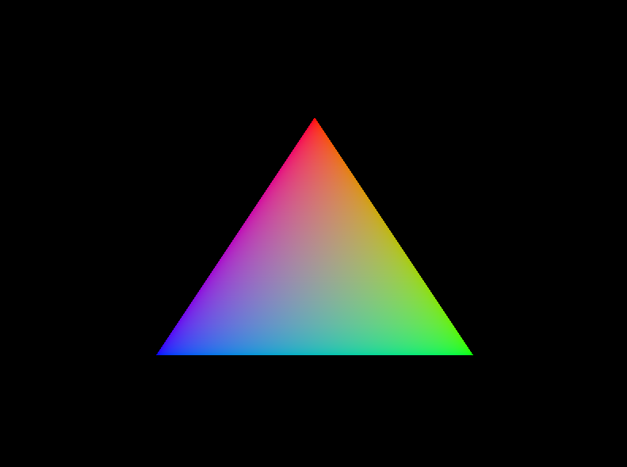

# CGPlayGround

## 1. Taichi

### 1.1. fractal

[Taichi/fractal.py](Taichi/fractal.py)

### 1.2. cloth simulation

[Taichi/cloth_simulation.py](Taichi/cloth_simulation.py)

## 2. Vulkan

### 2.1. triangle

[Vulkan/DemoTriangle/DemoTriangle.cpp](Vulkan/DemoTriangle/DemoTriangle.cpp)

