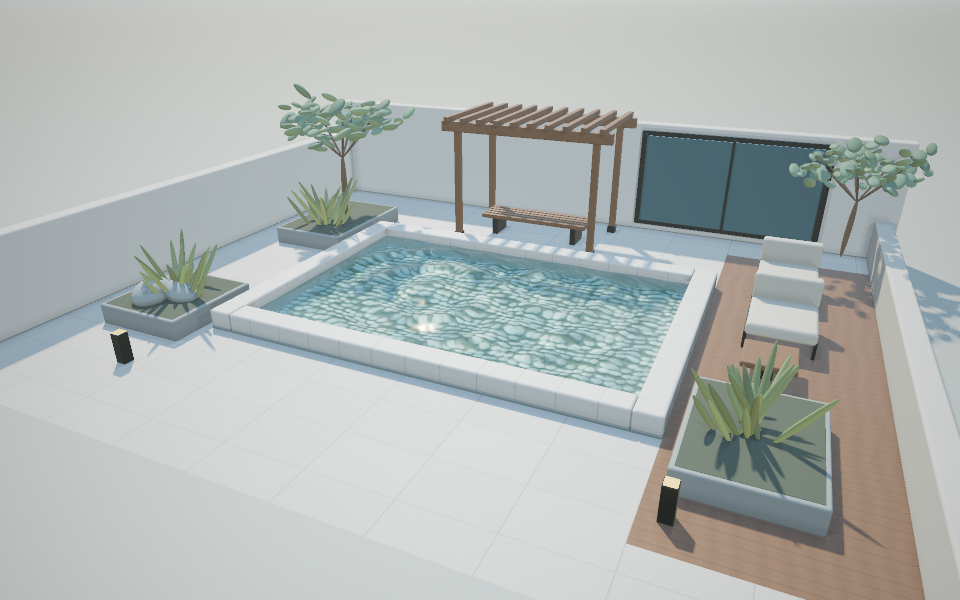

# Demo 01 · 庭院浅池

完整系列方案见 [WATER_DEMOS.md](../WATER_DEMOS.md)。
下一个 demo：[02 雨落池塘](demo_02.md)。



## 启动

```bash
cd /Users/john/git/CGPlayGround/Taichi
uv sync --locked
uv run python water/demo_01.py
```

默认 960 × 600，每像素四个空间采样，使用 Taichi 自动选择的 GPU 后端。
可指定后端、分辨率与采样数：

```bash
uv run python water/demo_01.py --backend vulkan --width 800 --height 500
uv run python water/demo_01.py --backend cpu --width 480 --height 300
uv run python water/demo_01.py --samples 1 --width 800 --height 500
```

首次启动需要编译 kernel，当前版本冷编译可能需要一分钟或更久，
耗时明显高于后续帧。启动时先在窗口创建前准备首帧，终端显示
`[Startup] Preparing first frame`；完成后才打开窗口并显示场景。
这避免首次编译时出现白色、无响应的窗口。

默认启用本地编译缓存，位于 `water/.taichi-cache/`，不纳入版本控制。
缓存效果取决于后端、代码与运行配置，修改 kernel 后仍可能重新编译。
排查缓存问题时可加 `--no-cache`。
若性能不足，先降低渲染分辨率或使用 `--samples 1`。
不需要下载模型、图片或其他资源；场景与材质均由程序生成。

## 视角和参数

| 操作 | 功能 |
|---|---|
| 鼠标左键拖动 | 围绕目标旋转 |
| 鼠标右键拖动 | 沿地面平移观察目标 |
| W / S 或上下方向键 | 拉近 / 拉远 |
| 1 / 2 / 3 | 全景 / 低角度 / 俯视 |
| R | 重置镜头、时间和材质参数 |
| 空格 | 暂停 / 继续波纹 |
| N | 暂停时推进 1/60 秒 |
| A | 开关自动环绕 |
| H | 显示 / 隐藏面板 |
| P | 保存无面板截图到 `--output` 指定的位置 |
| Esc | 退出 |

面板可调波幅、频率、时间速度、水体清澈度、日间到日落的光照与曝光。
`4x spatial AA` 可实时切换一个或四个采样，便于比较画面和性能。
相机始终保持在水面以上；水下介质切换留待 Demo 07。

## 截图与验证

无窗口渲染无需创建 GGUI 窗口，直接从 Taichi 图像场导出 PNG：

```bash
uv run python water/demo_01.py --headless --output output/demo_01.png
uv run python water/demo_01.py --headless --preset waterline --output output/demo_01_low.png
uv run python water/demo_01.py --headless --preset top --time 4 --output output/demo_01_top.png
uv run python water/demo_01.py --headless --frames 60 --width 640 --height 400
```

`--time` 指定初始时间，`--frames` 在无窗口模式下按固定的 1/60 秒推进，
最后一帧写入 `--output`。场景随机种子固定，可复现画面。

```bash
uv run python -m unittest discover -s water/tests -v
```

检查相机正交性与边界、波面解析导数、零波幅、池边连续性、不同预设的
有效图像、时间变化和暂停状态的确定性；还检查倒角求交与法线、定向
植物求交、分组包围盒和空间采样对高分辨率参考图的重建效果。
Taichi 在受限的 Codex 沙箱内
退出时可能出现段错误，运行验证需使用正常主机执行环境。

## 实现说明

- 渲染与水面计算均使用 Taichi kernel；GGUI 负责显示、输入与面板。
- 波形由两个径向衰减波源、弱方向波与两组中频高度波叠加，池边使用
  平滑衰减。同时计算高度及其解析导数；更细波纹只改变着色法线。
- 光线先与平均水面求交，再用六次受限 Newton 迭代求波面交点；
  比较水面与场景深度，正确遮挡池沿等物体。
- 粗糙反射默认追踪四个方向，折射追踪一个方向，每个方向只命中一次
  场景。水面采用 Schlick Fresnel、
  Snell 折射、Beer–Lambert 颜色吸收和太阳高光。
- 场景改为现代庭院：浅色围墙与石池、细缝铺装、深色木平台、木廊
  与长椅、休闲座椅、黑色金属构件、花池、橄榄树与观赏植物。
  背景包含窗面、天空与远山；采用 PBR 直射光、环境光和软阴影。
- 石池、木梁、座椅、花池与墙体使用真实圆角盒求交，先检查外包围盒，
  再在盒内执行有界 SDF 步进并计算倒角法线。
- 植物用分枝和定向的扁平椭球叶簇构成，观赏植物采用细长椭球叶片，
  不再使用球形树冠。每组有包围盒，用于跳过无关叶片求交。
- 默认每像素四个 2×2 空间采样，在同一时间计算并在线性辐亮度上取
  平均，随后执行色调映射；不使用历史帧，不引入时间累积拖影。
- 卵石使用带近似凹凸法线的程序化材质；焦散由太阳光穿过波面的折射
  光能累积生成。当前没有求解流体、完整光子映射或多次反射，也没有
  波纹点击交互。
- 在线性色彩空间计算光照，最后执行曝光、ACES 近似和 gamma 校正。

实现只使用 uv 环境内的 Taichi，不修改引擎源码。

## 验证范围

已验证 CPU、Metal 与 Vulkan 离屏渲染；GGUI 窗口、面板和事件循环通过
启动及有限帧退出检查。电脑控制权限未授予，鼠标和快捷键的实际操作
尚未进行自动化验证。镜头的计算逻辑已由上述测试验证。

第一轮的十一项渲染与相机测试通过，包含倒角、植物与抗锯齿验证。全景、
低角度和俯视截图均已检查，CPU、Metal 与 Vulkan 可正常渲染。

启动白屏问题已修复：首帧渲染与同步移到窗口创建之前，窗口创建后立即
显示准备好的图像，并启用本地编译缓存。新增启动顺序回归测试已通过。
本机 Metal 复核中，冷启动首帧准备耗时 30.74 秒，第二次启动为 0.84 秒；
两次均完成窗口显示与三帧后正常退出。这些耗时仅指首帧准备阶段。

## 第一轮视觉升级

本轮完成场景构图、背景、植物轮廓、几何倒角和空间抗锯齿。
场景与随机布局仍由程序生成，无外部模型或纹理下载。

场景包含 63 个倒角盒、284 个定向椭球，植物与景石分为六组进行
包围盒剔除。新版预览为上方的 `preview.png`。

本机 Vulkan 在 960 × 600 下，编译后五帧平均渲染耗时：

| 空间采样 | 平均渲染耗时 |
|---|---|
| 1 | 6.6 ms/帧 |
| 4（默认） | 23.9 ms/帧 |

测量包含 kernel 提交与同步，不包含窗口显示、面板和图片写入。
这些数值仅描述本机离屏测试，不代表完整应用帧率。

第一轮数据保留作为性能对照。当前版本已完成下方的第二、第三轮升级。


## 第二轮视觉升级

- 使用 Cook–Torrance GGX、Smith 遮蔽和 Schlick Fresnel；石材、木材、
  植物、抹灰、金属、窗面和织物有独立粗糙度、金属度及 F0。程序化
  凹凸法线与细微粗糙度变化改善高光；金属采用基色作为反射 F0。
- 程序生成两套线性 HDR 经纬环境图，分别表现晴天和日落；天空既参与
  背景显示，也参与环境照明。CPU 预计算余弦卷积辐照度、五级 GGX
  预过滤图和 split-sum BRDF LUT，再由 Taichi kernel 双线性查询。
  不需要下载 HDRI；环境图不含直射太阳，避免与太阳光重复计入。
- 默认太阳在圆盘上取四个固定方向，产生稳定的半影；默认半径 1.2°
  是展示用的艺术参数。关闭软阴影后采用中心方向的一个阴影样本。
- 接触 AO 在半球上发射三条最长 0.40 m 的遮挡射线，只衰减间接光。
  默认强度 0.65，可禁用。没有求解多次反弹的全局光照。
- 日落改变太阳高度、颜色和环境图；两盏庭院灯为附近表面提供有遮挡
  判断的暖色局部光。水面太阳高光也使用 GGX，折射与吸收模型保留。

右上角 `LIGHT / MATERIALS` 面板可调软阴影、太阳半径、接触 AO 和
环境亮度。原有镜头、波纹、曝光和 AA 控制均保留，R 会重置三个面板。

```bash
uv run python water/demo_01.py --lighting sunset
uv run python water/demo_01.py --headless --lighting sunset --output output/sunset.png
# 计算量较低的配置：
uv run python water/demo_01.py --backend metal --width 800 --height 500 --samples 1 --shadow-samples 1 --no-ao
```

性能取舍：主视线使用完整阴影和 AO；水面反射、折射中的次级命中采用
一个阴影样本并省略接触 AO。环境反射采用 split-sum 近似；窗面只反射
环境图。第二轮时水面使用一个清晰反射方向，低样本软阴影可能看见
分级边缘。当前粗糙反射、焦散与 Bloom 的实现见第三轮说明。


参考：[Filament PBR 与 IBL](https://google.github.io/filament/Filament.md.html)、
[PBRT 微表面理论](https://www.pbr-book.org/4ed/Reflection_Models/Roughness_Using_Microfacet_Theory)。


第二轮验证：原有 12 项相机、波面、几何、图像及启动顺序检查通过；新增
7 项检查覆盖 Fresnel 端点、BRDF 互易性与背面、常量环境能量、BRDF LUT、
经纬接缝与极点、接触 AO 开关、软阴影的完整与部分可见性，共 19 项。
CPU 数值检查通过；Metal 与 Vulkan 离屏画面已检查，全景、低角度和俯视
均有效。GGUI 完成首帧、两个面板及三帧退出检查；缓存后首帧准备为
1.39 秒。实际鼠标和键盘操作尚未自动化验证。

本机第二轮离屏测量（包含 kernel 提交与同步，排除 UI 与 PNG 写入）：

| 后端 / 分辨率 / 视角 | AA / 阴影 / AO | 编译后平均耗时 |
|---|---|---|
| Metal / 800×500 / 全景 | 4 / 4 / 开 | 45.1 ms/帧 |
| Vulkan / 960×600 / 全景晴天 | 4 / 4 / 开 | 70.6 ms/帧 |
| Vulkan / 960×600 / 全景日落 | 4 / 4 / 开 | 88.4 ms/帧 |
| Metal / 800×500 / 全景 | 1 / 1 / 关 | 5.7 ms/帧 |
| Metal / 800×500 / 低角度 | 1 / 1 / 关 | 7.3 ms/帧 |

光照升级增加了求交次数，完整画质未达到本机 60 FPS；可使用上述轻量
启动配置或在面板中降低画质。测试耗时随机器、后端、场景视角而变化。

## 第三轮视觉升级

### 粗糙反射与多尺度波纹

水面反射使用 GGX 可见微表面法线采样（VNDF），由每个微表面法线
计算反射方向，并用 Schlick Fresnel 与 Smith 遮蔽权重累积真实场景命中。
默认粗糙度 0.16，每个相机样本发射四条反射射线；四重空间 AA 下，
水面最多发射 16 条反射射线和 4 条折射射线。粗糙度为零时自动降为
一个镜面方向。采样序列固定，不使用时间累积或每帧随机噪声。

原有大波纹之外，两组中频波参与实际高度场与解析导数；两组更细波纹
只扰动着色法线。细节按估计的像素地面覆盖尺寸平滑衰减，减轻远处和
低角度闪烁；零波幅会关闭所有波纹，池边仍平滑归零。

### 波面折射焦散

每帧在水面水平投影上发射 256×192 个太阳光样本，用当前波面法线按
Snell 定律折射到 -0.68 m 的平面池底。在 128×96 图上按双线性权重
原子累积光能，计入 Fresnel 透射、源面积与接收面积比例、波面倾斜通量
以及太阳遮挡；随后用一个小滤波核去除采样颗粒，渲染时双线性读取。
焦散调制池底直射太阳光，阴影中的池底仍保留环境补光。

平水面形成接近均匀的光能分布；波纹使能量聚集与分散，焦散的运动与
水波使用同一时间、波幅和频率。太阳高度变化会改变光纹位置。暂停时
复用焦散图；修改波纹或光照参数后更新。关闭焦散后不再逐帧追踪。

这是一套针对浅池平面接收面的实时近似：只处理太阳经水面到池底的一次
折射，不处理池壁焦散、多次反弹、体积散射或完整光子映射。焦散使用
太阳中心方向，有限太阳角度和水面微表面粗糙度未参与光能发射；过滤与
强度上限 8 用于控制采样噪声和极端亮度。只在观察方向计入水中吸收，
尚未计入太阳入水路径的吸收。折射仍使用单一宏观方向，高粗糙度下的
透射没有完整积分。四方向反射也可能显出采样分级。

### HDR Bloom 与控制

渲染核输出线性 HDR 辐亮度。后处理先曝光，再按柔和阈值提取亮部，
降到四分之一宽高，执行两个方向的九点高斯滤波，再双线性上采样并
叠加；最后执行 ACES 近似、gamma 校正和暗角。默认 Bloom 强度 0.08，
阈值 1.0；通常只为太阳高光和灯光增添轻微辉光。

新增 `WATER / FINISH` 面板控制粗糙度、细波纹强度、四方向反射、焦散、
Bloom、亮部阈值与暗角。焦散或 Bloom 强度为零即可关闭。R 使用启动
参数重置全部效果；鼠标在三个面板内拖动时不会带动镜头。

```bash
uv run python water/demo_01.py --backend metal --lighting sunset
uv run python water/demo_01.py --water-roughness 0.3 --preset waterline
uv run python water/demo_01.py --water-roughness 0 --no-water-detail --no-caustics --no-bloom
# 轻量配置：
uv run python water/demo_01.py --backend metal --width 800 --height 500 --samples 1 --shadow-samples 1 --reflection-samples 1 --no-ao --no-caustics --no-bloom
```

全部新增核仍在窗口创建前准备，包括启动时关闭的可选效果，避免第一次
打开效果开关时发生冷编译并阻塞已显示的窗口。缓存目录与白屏修复保留。

实现入口为 `demo_01.py`，反射采样与 HDR 后处理见 `finish.py`。
参考：[PBRT 微表面理论](https://www.pbr-book.org/4ed/Reflection_Models/Roughness_Using_Microfacet_Theory)、
[GPU Gems 水焦散](https://developer.nvidia.com/gpugems/gpugems/part-i-natural-effects/chapter-2-rendering-water-caustics)。

### 第三轮验证与性能

共 26 项检查通过：原有 12 项相机、波面、几何、图像与启动顺序检查，
第二轮 7 项 PBR / IBL 检查，加上本轮 7 项检查。本轮覆盖镜面极限与
掠射角的反射权重、细节过滤、平水面焦散能量与动态聚焦、遮挡移除焦散、
HDR 黑场 / 亮点 / 色彩辉光、滤波保持常量以及非法粗糙度参数。

Metal 与 Vulkan 离屏渲染均通过；晴天、日落、全景、低角度与俯视截图
已检查。Metal 的 GGUI 完成首帧显示、三个面板构建及三帧退出验证，
缓存后首帧准备约 1.56 秒。实际鼠标与键盘操作仍未自动化验证。

本机第三轮离屏测量（包含所有逐帧焦散、渲染、后处理提交与同步，排除
窗口 UI 和 PNG 写入；冷编译单独计入首帧）：

| 配置 | 编译后平均耗时 |
|---|---|
| Metal，800×500，全景日落，默认完整画质 | 60.8 ms/帧 |
| Vulkan，960×600，全景晴天，默认完整画质 | 87.7 ms/帧 |
| Metal，800×500，全景，以上轻量配置 | 8.8 ms/帧 |

默认画质需要更多反射射线，当前未达到本机 60 FPS。可先关闭四方向
反射、降低 AA，再调整阴影、AO 和焦散；Bloom 可单独禁用。
这些数值随硬件、后端与视角变化，不代表完整窗口应用的帧率。
