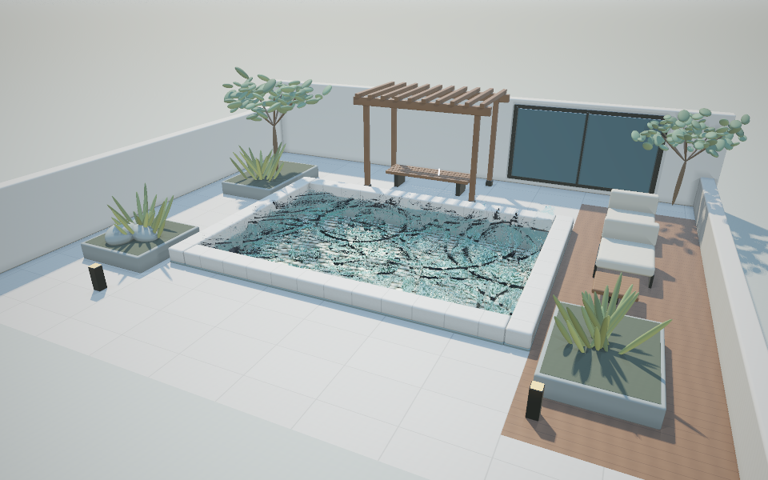

# Demo 02 · 雨落池塘

完整系列方案见 [WATER_DEMOS.md](WATER_DEMOS.md)。前一个 demo 见
[demo_01 说明](README.md)，下一个 demo 见
[03 日落海面](demo_03.md)。



## 启动

```bash
cd /Users/john/git/CGPlayGround/Taichi
uv sync --locked
uv run python water/demo_02.py
```

默认 960 × 600，每像素四个空间采样。默认雨量 0.08（32 个活跃雨滴）、
冲击强度 0.8、波速 0.9 m/s、水面粗糙度 0.065、细节波强度 0.3。
这组参数强调独立雨滴落点和向外扩张的环形涟漪，避免大量小波互相淹没。
池底纹理默认降至 20%，可通过 `Bed texture` 恢复鹅卵石的对比。
可指定后端、分辨率与采样数：

```bash
uv run python water/demo_02.py --backend metal --width 800 --height 500
uv run python water/demo_02.py --backend cpu --width 480 --height 300
uv run python water/demo_02.py --samples 1 --width 800 --height 500
```

首次启动需要编译 kernel，当前版本冷编译可能需要一分钟或更久。
启动时先在窗口创建前准备首帧，终端显示
`[Startup] Preparing first frame`；完成后才打开窗口并显示场景。
默认启用本地编译缓存，位于 `water/.taichi-cache/`，不纳入版本控制。

## 视角和参数

| 操作 | 功能 |
|---|---|
| 鼠标左键点击水面 | 在点击处生成波纹 |
| 鼠标左键拖动 | 围绕目标旋转 |
| 鼠标右键拖动 | 沿地面平移观察目标 |
| W / S 或上下方向键 | 拉近 / 拉远 |
| 1 / 2 / 3 | 全景 / 低角度 / 俯视 |
| R | 重置镜头、清空水面和雨滴、恢复参数 |
| 空格 | 暂停 / 继续 |
| N | 暂停时推进 1/60 秒 |
| A | 开关自动环绕 |
| H | 显示 / 隐藏面板 |
| P | 保存无面板截图到 `--output` 指定的位置 |
| Esc | 退出 |

左侧面板可调雨量、雨滴冲击强度、雨滴可见度、波速、阻尼、时间速度、
水体清澈度、日间到日落的光照与曝光。波速上限 1.8 m/s，保证显式
差分格式满足稳定性条件。点击 `Calm water` 立即平静水面。

## 截图与验证

```bash
uv run python water/demo_02.py --headless --output output/demo_02.png
uv run python water/demo_02.py --headless --preset waterline --output output/demo_02_low.png
uv run python water/demo_02.py --headless --preset top --time 4 --output output/demo_02_top.png
uv run python water/demo_02.py --headless --frames 60 --width 640 --height 400
```

`--time` 指定首帧前的下雨预热秒数，`--frames` 在无窗口模式下按固定的
1/60 秒推进，最后一帧写入 `--output`。雨滴生成使用固定随机种子，
画面可复现。

```bash
uv run python -m unittest discover -s water/tests -v
```

测试覆盖波动方程的稳定性、传播、阻尼衰减、双线性采样精度、雨水确定
性与区域约束、焦散对水面状态的响应、拾取反投影往返、暂停确定性、
参数校验和启动顺序。

## 实现说明

### 波动模拟

水面高度由二维波动方程的有限差分格式求解。网格 256 × 172 覆盖整个
池面，单元边长 0.025 m。时间积分采用蛙跳格式，固定时间步 1/120 秒，
离屏模式每显示帧推进两个子步，交互模式按累积时间推进子步。
雨滴、波面和细节波统一使用此模拟时钟，时间速度不会被重复乘算。
普通慢帧会补足实际经过的时间（例如 100 ms 推进 12 个子步），避免
每帧只计入 50 ms 造成慢动作；长时间停顿最多补 32 个子步。三个缓冲依次轮转当前、上一、下一时刻，避免
重绑定字段引用。显式格式的稳定性要求波速乘时间步除以单元边长小于
1/√2，波速面板范围据此限制在 0.3 到 1.8 m/s。

池壁采用零梯度边界，波纹到达池壁后反射回来，可以观察到来回交错的
干涉纹样。阻尼默认 0.994，衰减每步的速度差，而不直接缩放高度：

```text
h_next = h + damping * (h - h_prev) + (c * dt / dx)^2 * Laplacian(h)
```

因此，静止的均匀水位保持不变，不会自行振荡。模拟状态包含独立的
版本号；推进、点击、雨滴冲击、清空都会更新版本，供法线和焦散缓存使用。
通过 `h.from_numpy()` 等方式外部写入高度场后，应调用 `sim.mark_dirty()`。

### 雨滴

雨滴生成表由固定种子预先计算，每个雨滴落水后按序取下一个生成表项，
构造时立即初始化雨滴的位置、速度和生成表索引，避免首帧所有雨滴
重合在原点。水平漂移约束在池面范围内。

落水时注入小幅速度冲击，默认单滴峰值约 0.6～0.9 m/s。空间分布采用高斯
核的离散负拉普拉斯，正负部分相互抵消，不增加净水量；支持域随半径
扩展到三个半径，边缘的值与导数归零，避免硬截断造成尖锐波纹。
雨丝按视线到短线段的距离着色，并与场景和水面深度比较。

### 交互

点击水面时，把鼠标位置反投影为视线并与平均水面求交，交点在池内
则注入约 1.2 cm 的零体积位移扰动，同时修改当前和上一时刻高度，
避免把点击误当成猛烈的瞬时速度。按下后移动超过阈值视为拖动旋转，
不会产生波纹。

### 渲染

渲染复用 Demo 01 的水材质：Schlick Fresnel、Snell 折射、Beer–Lambert
吸收、GGX 太阳高光、粗糙反射、池底焦散和 HDR 后处理。波面求交改用
实测高度包围盒内的逐网格 DDA 遍历：每个双线性单元内求解精确二次
方程，按距离寻找第一个进入水体的交点，避免低角度下牛顿迭代漏掉波峰
或命中后面的交点。

几何法线用于求交和次级光线偏移。着色法线由节点中心差分梯度插值，
再用像素覆盖范围内的高斯求积采样过滤，避免边角采样抵消可见波长；两组细节波也随覆盖尺寸衰减。掠射视角下保证
着色法线面向视线。两个 demo 均移除了无条件取环境天空颜色最大值的
补亮，保留场景物体真实的反射和遮挡。

焦散直接读取模拟高度和连续梯度。缓存同时检查模拟版本、光照、细节波
强度及动画时间；暂停后点击、清空或调节细节波都会刷新光纹。
`Calm water` 清除模拟涟漪；若希望完全平静的法线与均匀焦散，同时将
`Fine waves` 设为零。

场景几何、环境光照和 PBR 着色从 Demo 01 抽取到 `scene.py`，
两个 demo 共享 `CourtyardScene`。Demo 01 重构后全部原有测试保持通过。

## 验证范围

本轮 Demo 02 的 24 项回归检查全部通过，新增单滴波前外扩及慢帧时间
补偿检查；Demo 01 与共享模块上轮通过 26 项检查，本轮未修改它们。

本轮新增回归检查覆盖首次启动分散雨滴、零净水量、静止水位、速度阻尼、
单滴冲击上限、浅角最近交点、池边与平面求交、连续法线、像素覆盖过滤，
以及暂停下清空、点击和细节波变动时的焦散缓存刷新。

默认启动预热两秒后，波高范围约 −10 到 +18 mm，32 个活跃雨滴
各自处于不同位置。波幅为演示可读性作了适度夸张，同时保持零净水量
和模拟稳定性。已生成两秒实际模拟动画，检查落点、波纹扩张及焦散运动。

本轮 Metal 离屏检查覆盖全景、低角度及连续动画；CPU 渲染回归覆盖
全部三个视角。GGUI 完成首帧显示、面板构建及三帧退出，新材质冷编译
首帧准备约 61 秒，预热在窗口创建之前完成。实际鼠标点击与键盘操作
尚未自动化验证。

本轮 960 × 600 默认完整画质的动画离屏短测约 147 ms/帧（每帧推进
六个模拟子步，包含焦散、渲染、后处理与同步，排除编译和 GIF 编码）。
默认画质仍未达到本机 60 FPS；需要更流畅的交互时，可以使用：

```bash
uv run python water/demo_02.py --width 800 --height 500 --samples 1 --reflection-samples 1
```
