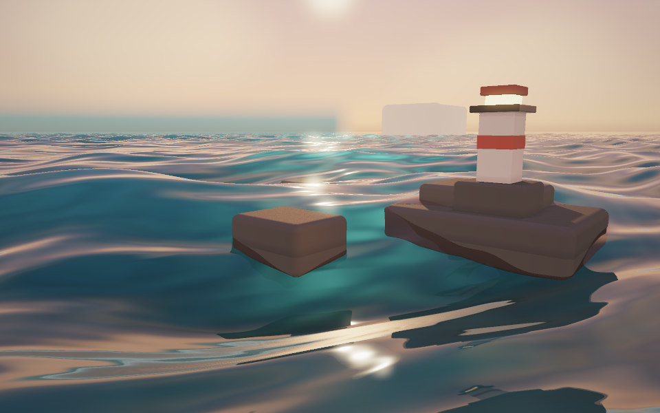

# Demo 03 · 日落海面

完整系列方案见 [WATER_DEMOS.md](WATER_DEMOS.md)。前一个 demo 见
[demo_02 雨落池塘](demo_02.md)。



## 启动

```bash
cd /Users/john/git/CGPlayGround/Taichi
uv sync --locked
uv run python water/demo_03.py
```

默认 960 × 600，每像素四个空间采样。默认日落光照、风速 8 m/s、风向
35 度、波高 1.3 m、陡峭度 0.6、波长尺度 0.8、水面粗糙度 0.05、细节波
强度 0.5。主波长约 15 m，波谱按 0.72 的几何比下降到 0.4 m 左右，
与近景礁石和灯塔的尺度匹配。
可指定后端、分辨率与采样数：

```bash
uv run python water/demo_03.py --backend metal --width 800 --height 500
uv run python water/demo_03.py --backend cpu --width 480 --height 300
uv run python water/demo_03.py --samples 1 --width 800 --height 500
uv run python water/demo_03.py --lighting day --wind 14 --wave-height 2.0
```

首次启动需要编译 kernel，当前版本冷编译可能需要一分钟或更久。
启动时先在窗口创建前准备首帧，终端显示
`[Startup] Preparing first frame`；完成后才打开窗口并显示场景。
默认启用本地编译缓存，位于 `water/.taichi-cache/`，不纳入版本控制。

## 视角和参数

| 操作 | 功能 |
|---|---|
| 鼠标左键拖动 | 围绕目标旋转 |
| 鼠标右键拖动 | 沿地面平移观察目标 |
| W / S 或上下方向键 | 拉近 / 拉远 |
| 1 / 2 / 3 | 全景 / 低角度 / 俯视 |
| R | 重置镜头、波谱与参数 |
| 空格 | 暂停 / 继续 |
| N | 暂停时推进 1/60 秒 |
| A | 开关自动环绕 |
| H | 显示 / 隐藏面板 |
| P | 保存无面板截图到 `--output` 指定的位置 |
| Esc | 退出 |

左侧面板可调风速、风向、波高、陡峭度、波长尺度、时间速度、水体清澈度、
日间到日落的光照与曝光。风速范围 0 到 24 m/s，陡峭度范围 0 到 1。
修改任一风浪参数会在下一帧用同一固定种子重建波谱，画面连续变化。

## 截图与验证

```bash
uv run python water/demo_03.py --headless --output output/demo_03.png
uv run python water/demo_03.py --headless --preset waterline --output output/demo_03_low.png
uv run python water/demo_03.py --headless --preset top --time 4 --output output/demo_03_top.png
uv run python water/demo_03.py --headless --frames 60 --width 640 --height 400
```

`--time` 指定首帧前的波浪预热秒数，`--frames` 在无窗口模式下按固定的
1/60 秒推进，最后一帧写入 `--output`。波谱生成使用固定随机种子，
画面可复现。

```bash
uv run python -m unittest discover -s water/tests -v
```

测试覆盖波谱的色散关系、陡峭度约束、幅值归一、重建确定性与参数校验，
波面高度与法线的数值精度，射线步进求交的近距、掠射与参考对比，
以及渲染的有限性、暂停确定性、风浪敏感性和启动顺序。

## 实现说明

### Gerstner 波谱

12 个方向 Gerstner 波叠加。主波长由风速和尺度因子决定，深水色散关系
给出频率。为降低重复感，波谱引入四层随机性，全部来自固定种子：

- 波长不按固定几何比下降，每档比率在 0.62 到 0.82 之间随机取值，
  避免等比阶梯特有的拍频条纹；
- 最后 3 个分量组成横向涌浪，方向相对主风向偏 50 到 130 度，
  占两成振幅，打乱整齐排列的波峰；
- 两个波长远长于主波（5 到 9 倍）的包络波对整片波高做慢变空间
  调制，海面呈现 patchy 的浪区起伏；
- 方向围绕风向展开，展开角随波长缩短而增大，长浪更贴近风向。

幅值按 k 的幂律分配并加固定种子抖动，归一化到面板波高。每个波的
陡峭度 Q 取 steepness / (k A n)，保证全部波的 Q k A 之和等于
陡峭度参数，这是波峰不自我交叉的标准约束。陡峭度越大，波峰越尖、
波谷越宽；接近 1 时峰顶开始卷曲。法线由解析切线与副切线叉积得到，
包含水平位移与包络坡度的贡献，比纯高度场梯度更陡。

求交把波面位移当作高度场处理，忽略水平位移，这是 GPU Gems 的标准
近似；着色法线仍用完整解析式，波峰视觉形状与求交位置之间的偏差
在该近似下不可察觉。

### 求交

视线先在波幅包围盒上做板层裁剪，上升射线直接判 miss。进入板层后
按表面误差与距离增长的步长上限步进：近处步长由距波面高度误差决定，
远处步长按距线性放宽，工作量随距离对数增长。发现符号翻转后用十次
二分细化交点。步进上限 160 次，远平面 1500 m。命中后由解析式给出
几何法线，三组细节波按像素地面覆盖尺寸衰减后叠加为着色法线；
掠射视角下着色法线与几何法线混合，保证法线面向视线。

### 渲染

水材质沿用 Demo 02 的结构：Schlick Fresnel、Snell 折射、温和的
Beer–Lambert 吸收、GGX 可见微表面粗糙反射和 GGX 太阳高光。折射光
射向 7 m 深的暗色海底，吸收系数略强于浅池，深水色调偏蓝黑。
波高对上涌水色做线性调制，俯视时折射占主导，涌浪纹样因此保持可见。
低角度的夕阳经 GGX 高光拉成长条闪烁路径。

距离雾按命中距离的平方指数增长，雾色取同一方位角的地平线环境色，
水面和礁石在远处融入天空。两座远礁在雾中只留剪影。

场景通过 `CourtyardScene` 新增的 `build_static` 钩子复用共享框架：
环境光照、PBR 着色、后处理和轨道相机全部继承，静态场景替换为
灯塔礁石、前景暗礁和远礁，海底材质替换为暗色沙地。Demo 01 与
Demo 02 的构建路径不变。

## 验证范围

本轮 Demo 03 的 19 项回归检查全部通过；既有 39 项检查本轮同步重跑
保持通过。新增检查覆盖深水色散关系、陡峭度之和约束、幅值归一与
重建确定性、法线单位性与向上性、法线对参数曲面的有限差分验证、
尖峰坡度超过正弦波、垂直与水平射线求交、掠射求交与密集参考对比、
命中残差、三个机位日间与日落渲染、暂停确定性、风浪重建敏感性、
参数校验和启动顺序。

Metal 离屏检查覆盖全景、低角度与俯视：日落全景呈现涌浪、夕阳长条
高光、灯塔倒影与雾中远礁；低角度贴近波面；俯视可见上涌调制的涌浪
纹样。CPU 回归覆盖全部三个机位与求交数值检查。实际鼠标与键盘操作
尚未自动化验证。

本机 960 × 600 默认完整画质（四采样 AA、四方向反射）离屏测量：

| 视角 | 编译后平均耗时 |
|---|---|
| 全景 | 64～156 ms/帧 |
| 低角度 | 111～172 ms/帧 |
| 俯视 | 28～50 ms/帧 |

耗时随视角波动较大：低角度与全景的大部分像素要走完步进，俯视的
大量像素快速命中近处水面。默认画质未达到本机 60 FPS；需要更流畅的
交互时，可以使用：

```bash
uv run python water/demo_03.py --width 800 --height 500 --samples 1 --reflection-samples 1
```
