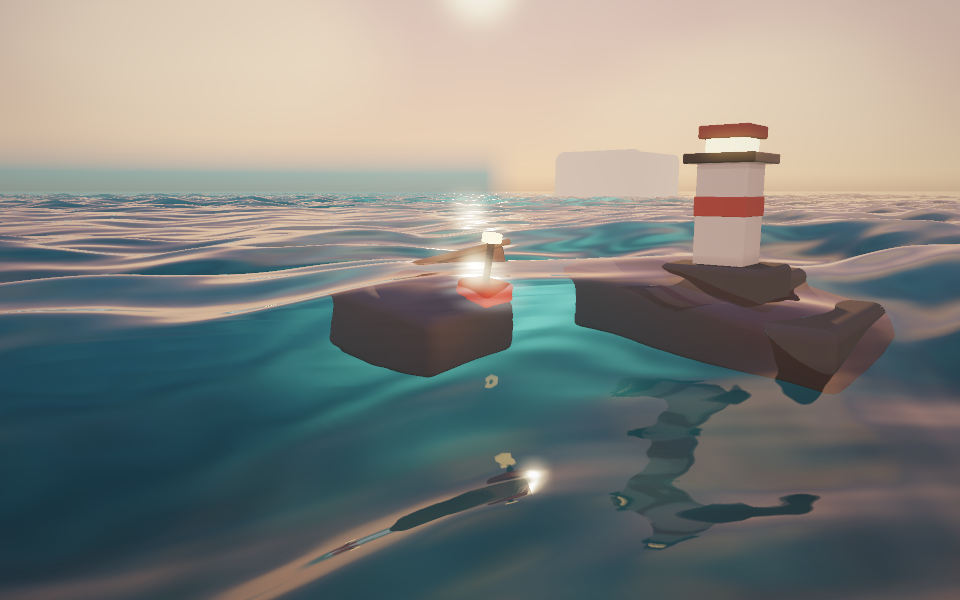

# Demo 04 · 浮标与小船

完整系列方案见 [WATER_DEMOS.md](WATER_DEMOS.md)。前一个 demo 见
[demo_03 日落海面](demo_03.md)。



## 启动

```bash
cd /Users/john/git/CGPlayGround/Taichi
uv sync --locked
uv run python water/demo_04.py
```

默认 960 × 600，每像素四个空间采样。默认日落光照、风速 8 m/s、波高
1.3 m、水面粗糙度 0.05、细节波强度 0.5，海面与 demo 03 相同。
场景里有三个浮标和一艘小船；`--cruise` 让船一启动就绕半径 6 m 的
圆圈缓慢巡航：

```bash
uv run python water/demo_04.py --backend metal --width 800 --height 500
uv run python water/demo_04.py --backend cpu --width 480 --height 300
uv run python water/demo_04.py --cruise --lighting day --wind 14 --wave-height 2.0
```

首次启动需要编译 kernel，当前版本冷编译可能需要一分钟或更久。
启动时先在窗口创建前准备首帧，终端显示
`[Startup] Preparing first frame`；完成后才打开窗口并显示场景。
默认启用本地编译缓存，位于 `water/.taichi-cache/`，不纳入版本控制。

## 视角和参数

| 操作 | 功能 |
|---|---|
| 左键按住船体拖动 | 移动小船（船艏朝运动方向，尾部留下尾迹） |
| 鼠标左键拖动 | 围绕目标旋转（未按在船上时） |
| 鼠标右键拖动 | 沿地面平移观察目标 |
| W / S 或上下方向键 | 拉近 / 拉远 |
| 1 / 2 / 3 | 全景 / 低角度 / 俯视 |
| C | 开关小船自动巡航 |
| R | 重置镜头、波谱、浮体与尾迹 |
| 空格 | 暂停 / 继续 |
| N | 暂停时推进 1/120 秒仿真 |
| A | 开关自动环绕 |
| H | 显示 / 隐藏面板 |
| P | 保存无面板截图到 `--output` 指定的位置 |
| Esc | 退出 |

左侧面板可调风速、风向、波高、陡峭度、波长尺度、时间速度、水体清澈度、
日间到日落的光照与曝光，以及小船巡航开关。修改任一风浪参数会在下一帧
用同一固定种子重建波谱，画面连续变化。

## 截图与验证

```bash
uv run python water/demo_04.py --headless --cruise --time 10 --output output/demo_04.png
uv run python water/demo_04.py --headless --cruise --preset waterline --time 10 --output output/demo_04_low.png
uv run python water/demo_04.py --headless --cruise --preset top --time 6 --output output/demo_04_top.png
uv run python water/demo_04.py --headless --frames 60 --width 640 --height 400
```

`--time` 指定首帧前的仿真预热秒数，`--frames` 在无窗口模式下按固定的
1/60 秒推进仿真，最后一帧写入 `--output`。波谱生成使用固定随机种子，
画面可复现。

```bash
uv run python -m unittest discover -s water/tests -v
```

测试覆盖尾迹场的平坦稳定性、CFL 条件、零净水量注入、传播衰减、
吸收边界、双线性采样精度；浮体的吃水深度、静水复原力矩（含力矩
符号检查）、船速限制、目标追踪、无指令漂移、确定性与复位；碰撞的
分离投影、冲量方向、拖船无限质量、静态礁石推出与确定性；泡沫的
位置分布；渲染的有限性、三个机位、移动船只的帧差异、参数校验、
拾取射线和启动顺序。

## 实现说明

### 浮体动力学

每个浮体在中心加四个水线角点共五个采样点读取波面高度与垂向水质点
速度（Gerstner 解析式加尾迹场双线性采样），按采样点平均得到合浮力
加速度 160 乘以浸深，再减去重力积分垂荡；角点浮力差对原点取矩，
按 0.3 的增益积分 pitch 与 roll，角速度每步乘阻尼。采样点的世界坐标
包含姿态旋转后的垂直分量，静水倾斜时角点一升一沉，复原力矩才能把
船扶正——这一点由静水测试直接验证力矩符号。船体的水平运动是运动学
的：以不超过 2.2 m/s 的速度朝目标点前进，艏向用角速度限幅缓转到
速度方向，尾迹由船艉注入。

浮体渲染为旋转后的圆角盒组合（船身、船舷、座板、马达；浮筒、立杆、
顶标），光线经转置旋转矩阵变换到体局部坐标后走共享的圆角盒求交，
法线再旋回世界坐标。泡沫在着色阶段按局部坐标判定：浮标用径向环带，
船用二维盒符号距离的内外双侧环带，强度随航速与相位噪声调制，
叠加在水面颜色上。

### 碰撞检测

每个零件配一个碰撞代理球：半径取零件水平对角线减去倒角，接触发生
在可见船体附近而不是包围盒。浮体之间、浮体与静态礁石之间做球-球和
球-盒（轴对齐最近点）检测，响应只在水平面解算——位置投影分离穿透，
接近速度乘以恢复系数 0.15 做等质量冲量，竖直方向始终归浮力系统。
每子步迭代四轮，避免一对的修正把另一对推入重叠。擦碰的冲量对质心
取矩写入角速度的 yaw 分量，船头自然偏转；被拖动的小船按无限质量
处理，把浮标推开而自己不受冲量。球心完全落入盒内时按逃逸距离最短
的轴推出，保证高速拖船也不会穿透礁石。

### 尾迹场

32 m 见方的二维波动方程网格（256 × 256，格距 0.125 m，波速 3 m/s，
Courant 数 0.2），与 demo 02 相同的蛙跳格式和零净水量注入。差别在
边界： demo 02 的池壁靠钳制邻居做全反射，本 demo 边缘 12 格是
0.95 到 1.0 的渐变吸收带，尾迹到达域边界后被吃掉而不是反射回
场景。船艉按航速注入向外的速度扰动，浮标按垂荡速度注入小环，
注入同时进入求交高度与法线（`extra_height` / `extra_slope` 钩子），
也进入浮力采样的水质点速度，构成单向的流固近似反馈。

### 与 demo 03 的关系

海面、求交、着色、雾和场景框架全部继承 demo 03；demo 03 为此新增
了三个空操作的着色钩子（附加高度、附加坡度、泡沫）和波面垂向速度
解析式，demo 04 直接覆写。渲染循环对几何求改成了动态循环——16 个
圆角盒零件静态展开会让渲染 kernel 的编译超过十分钟，动态循环把编译
时间降到两分钟以内（demo 03 静态展开教训的又一次印证）。

## 验证范围

本轮 Demo 04 的 26 项回归检查全部通过；既有 91 项检查本轮同步重跑
保持通过。新增检查覆盖尾迹场的平坦稳定性、CFL 条件、注入传播与衰减、
吸收边界、零净水量与双线性精度；浮体的吃水、静水扶正、船速限制、
目标追踪、确定性、复位与拾取；碰撞投影分离、冲量方向、拖船无限质量、
礁石推出与碰撞确定性；泡沫分布；三机位渲染、移动船只帧差异、
参数校验和启动顺序。

Metal 离屏检查覆盖全景、低角度与俯视：全景可见船体尾迹、浮标泡沫环
与灯塔倒影；低角度贴近波面观察船体与水面的接触；俯视可见尾迹条纹与
泡沫环分布。CPU 回归覆盖全部数值检查。实际鼠标拖船与键盘操作尚未
自动化验证。

本机 960 × 600 默认完整画质（四采样 AA、四方向反射）离屏测量：

| 视角 | 编译后平均耗时 |
|---|---|
| 全景 | 376 ms/帧 |
| 低角度 | 359 ms/帧 |
| 俯视 | 61 ms/帧 |

浮体求交与泡沫增加了每像素的固定开销，全景与低角度比 demo 03 慢
约两到三倍。需要更流畅的交互时，可以使用：

```bash
uv run python water/demo_04.py --width 800 --height 500 --samples 1 --reflection-samples 1
```
