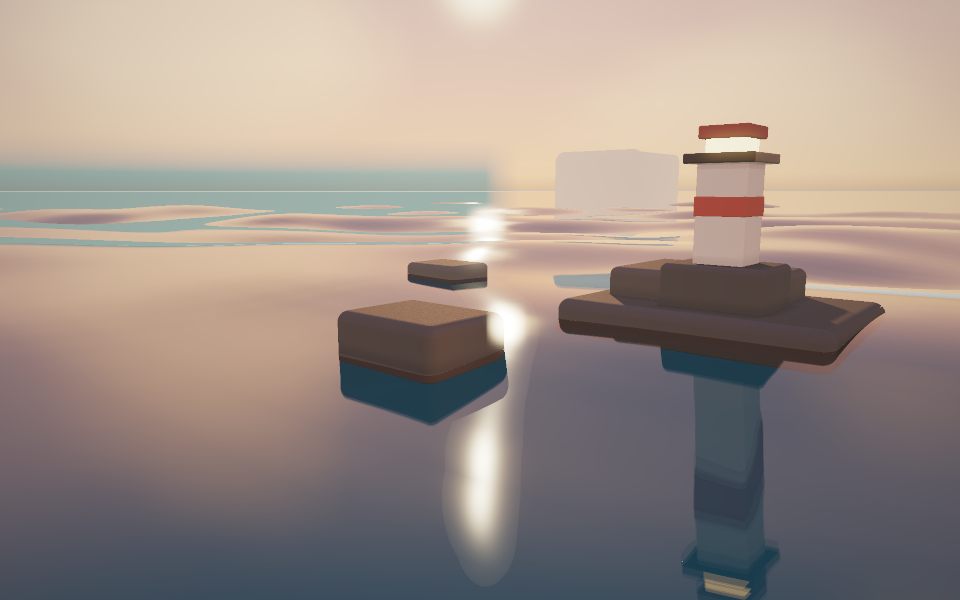

# Demo 05 · 风场海洋

完整系列方案见 [WATER_DEMOS.md](WATER_DEMOS.md)。前一个 demo 见
[demo_04 浮标与小船](demo_04.md)。



## 启动

```bash
cd /Users/john/git/CGPlayGround/Taichi
uv sync --locked
uv run python water/demo_05.py
```

默认 960 × 600，每像素四个空间采样。默认日落光照、风速 8 m/s、风向
35 度、有效波高 1.3 m、chop（波峰水平挤压）0.6。海面不再是几条 Gerstner
波的组合，而是每帧在频域合成的一块 512 m 周期海浪瓦片：Phillips 波谱
按固定种子填充复振幅，深水色散关系转动相位，原位基-2 逆 FFT 变回高度
与水平位移网格。海况预设：

```bash
uv run python water/demo_05.py --sea breeze        # 微风：波高 0.35 m
uv run python water/demo_05.py --sea swell         # 涌浪：窄方向长波
uv run python water/demo_05.py --sea gale          # 强风：波高 2.6 m、大浪
uv run python water/demo_05.py --wind 12 --wind-dir 80 --wave-height 1.8 --chop 0.7
```

首次启动需要编译 kernel，冷编译可能需要一分钟或更久。启动时先在窗口
创建前准备首帧，终端显示 `[Startup] Preparing first frame`；完成后才打开
窗口。默认启用本地编译缓存，位于 `water/.taichi-cache/`，不纳入版本控制。

## 视角和参数

| 操作 | 功能 |
|---|---|
| 鼠标左键拖动 | 围绕目标旋转 |
| 鼠标右键拖动 | 沿地面平移观察目标 |
| W / S 或上下方向键 | 拉近 / 拉远 |
| 1 / 2 / 3 | 全景 / 低角度 / 俯视 |
| 空格 | 暂停 / 继续 |
| N | 暂停时推进 1/60 秒 |
| A | 开关自动环绕 |
| H | 显示 / 隐藏面板 |
| P | 保存无面板截图到 `--output` 指定的位置 |
| R | 重置镜头与海况参数 |
| Esc | 退出 |

左侧面板可调风速（0–24 m/s）、风向、波高（0.05–3.5 m）、chop
（0–1）、涌浪谱开关、时间速度、水体清澈度、日间到日落的光照与曝光，
以及波峰泡沫强度。右侧 Fine waves 调节 FFT 短波法线强度，默认 1；
关闭时保留中层的长波法线，不额外叠加规则正弦细纹。修改任一海况
参数会在下一帧用同一固定种子重建波谱，画面连续变化。

## 截图与验证

```bash
uv run python water/demo_05.py --headless --time 2 --output output/demo_05.png
uv run python water/demo_05.py --headless --preset waterline --time 2 --output output/demo_05_low.png
uv run python water/demo_05.py --headless --preset top --time 2 --output output/demo_05_top.png
uv run python water/demo_05.py --headless --frames 60 --width 640 --height 400
```

`--time` 指定首帧前的预热秒数，`--frames` 在无窗口模式下按固定的
1/60 秒推进，最后一帧写入 `--output`。波谱生成使用固定随机种子，
画面可复现。

```bash
uv run python -m unittest discover -s water/tests -v
```

## 实现说明

### Phillips 波谱与逆 FFT

主机端生成唯一的 512² 复高斯振幅场 h0。谱形由主风浪、中间波系和短风浪
三个成分组成，总方差归一到（有效波高/4）²。中间、短浪权重分别为 0.12
与 `0.06 × min(风速/10, 1)²`，方向分别偏转 18、35 度；主波系额外衰减
18 m 以下的短波，所有成分对 8 m 以下波长平滑截止，避免短波支配坡度。
涌浪模式使用 `exp(-(k/k_cap)⁶)` 的长波低通，修正此前方向相反的滤波。

每帧按深水色散关系 `ω = √(gk)` 转动相位，以共轭对称构造实数海面，
然后在 Taichi 内执行二维基-2 逆 FFT。高度及两个水平位移分量共用蝶形
流水线；奇数和偶数蝶形级数均处理最终缓冲位置，支持任意 2 的幂网格。

水平位移谱用于计算 Jacobian，在折叠信号与高波峰同时出现处生成泡沫。
泡沫按像素足印过滤，去掉原有单一正弦明暗调制，避免斜向排线。

### 相位一致的三级 LOD 与连续采样

同一 512 m 瓦片使用 512、128、32 三种分辨率，格距分别为 1、4、16 m。
粗层从主波谱按有符号频率截取，并在各自截止频率附近平滑衰减；不会独立
生成随机相位，也不会把粗层能量重新放大到完整波高，因此同一长浪在各层
位置一致。着色法线与泡沫根据像素在水面上的足印混合，避免按世界原点
距离切换造成环形明暗带。求交高度始终使用最细层。

高度使用周期 Catmull–Rom 双三次插值，法线由同一插值函数的解析导数
计算。跨网格边界的高度与一阶导数连续，避免双线性格子的折角；最细格距
由 2 m 降到 1 m，提高近景波形精度。

### 求交与深水着色

每帧归约实际高度最小值和最大值，并加入双三次插值可能产生的过冲余量，
替代把四倍标准差当作极值范围的近似，避免高峰或波谷被裁掉。二分精化
结束后在最终交点重新计算法线，消除位置和法线不一致的反射折线。

Demo 05 将海底放到水下 80 m，使用无规则纹理的底色，水体透射长度上限
为 120 m。水色由 Beer 吸收、体色和朝向光照决定，去掉直接随波高变化的
明暗染色。这样不会把浅水海底的规则正弦纹理或粗网格高度画到海面上。

### 与 demo 03 的关系与边界

步进求交、PBR 着色、天空、雾和灯塔礁石继承 demo 03。共享渲染器新增
高度范围、海底深度、水体着色、过滤法线和泡沫等可覆写方法；默认实现
保留 Demo 03/04 的材质设置，仅精化交点法线修复同时生效。

当前几何仍为显式高度场：chop 的水平位移参与泡沫判定，尚未反演到几何
求交中，因此不会产生真正翻卷或水平挤压的浪峰。瓦片仍有 512 m 周期；
远处通过雾与像素过滤弱化重复。强风主波长很长，近景呈现宽阔长涌，
并非所有海况都应布满小波纹。

## 验证范围

Demo 05 的 27 项检查已在 Metal 后端通过；CPU 后端另行验证了 18 项
FFT、波谱与插值检查及严格的精化交点一致性检查。

扩展验证把全系列测试初始化切到实际渲染使用的 Metal 后端，共 123 项，
121 项通过。剩余两项为本轮未修改的既有用例：Demo 02 推进后的局部画面
最大变化量为 0.0181，低于测试阈值 0.02（暂停帧本身完全一致）；Demo 04
岩石碰撞后的 z 速度仍为 -1，未满足非负要求。两项都在测试原定的 CPU
后端单独复测通过。此结果不等同于整套 CPU 回归全部通过，也不代表
Metal 下这两项问题已修复；本轮共享 Demo 03/04 的渲染检查均通过。

回归检查覆盖 FFT 与 NumPy 逆变换对照、奇数蝶形级数、色散、有效波高、
重建确定性、实数性、各层 Fourier 相位一致与方差递减、像素过滤及周期性、
双三次高度和解析导数、实际包围范围、精化交点法线、泡沫与参数控制。
同时重跑 Demo 01–04 的既有测试，检查共享渲染器兼容性。

Metal 画面检查覆盖全景、低角度、俯视、拉远俯视，以及微风、涌浪和强风。
更新后的默认预览见文首。本机 960 × 600、四个空间采样的全景测量，编译
后平均约 71.0 ms/帧；比旧版更精确的网格与双三次求交增加了计算成本。
首次冷编译实测约三分钟，期间在创建窗口前完成首帧准备。需要更流畅的
交互时，可降低分辨率和采样数：

```bash
uv run python water/demo_05.py --width 800 --height 500 --samples 1 --reflection-samples 1
```
