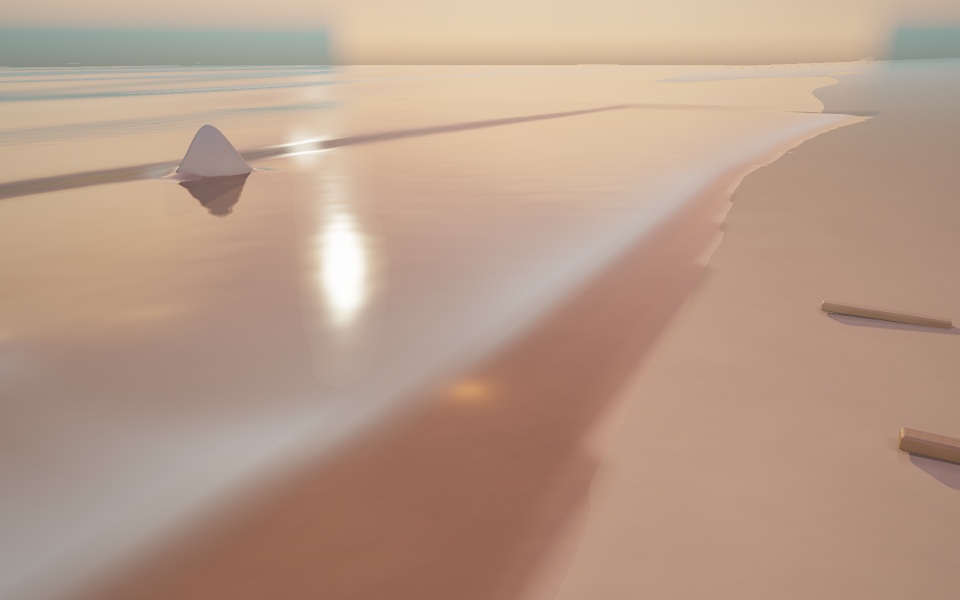

# Demo 06 · 沙滩与礁石

完整系列方案见 [WATER_DEMOS.md](WATER_DEMOS.md)。前一个 demo 见
[demo_05 风场海洋](demo_05.md)。



## 启动

```bash
cd /Users/john/git/CGPlayGround/Taichi
uv sync --locked
uv run python water/demo_06.py
```

默认 960 × 600，每像素四个空间采样。与前面几个 demo 的解析波面不同，这一个
demo 在 256 × 256 的网格上数值求解浅水方程：128 m 见方的海域（x、z ∈
[−64, 64]），每格 0.5 m，显式推进，对外步长 1/30 s（内部按 CFL 自动细分）。海底是解析地形：坡度 0.045
的斜坡岸线（静止水线 x ≈ 4）叠加一段非周期的缓弯曲（三个不可通约正弦之和，
避免单一正弦画出正弦状水线），再加上四座高斯礁石，最高的一座顶部高出静水面
约 1–2 m，出水成小岛。西边界按给定振幅和周期生成入射波并向岸传播，波在浅水
区增陡、形成破碎泡沫并爬滩，留下泡沫和湿沙痕迹。沙滩上散
着几根漂流木，点击水面可以激起一团高斯扰动。

海况预设：

```bash
uv run python water/demo_06.py --sea calm        # 轻浪：波幅 0.12 m、周期 9 s
uv run python water/demo_06.py --sea surf        # 碎浪：波幅 0.30 m、周期 10 s
uv run python water/demo_06.py --sea storm       # 风暴：波幅 0.55 m、周期 13 s
uv run python water/demo_06.py --wave-amplitude 0.4 --wave-period 7
```

波幅调节范围 0.05–0.6 m，周期 6–16 s。首次启动需要编译 kernel，冷编译可能
本机约需 2–4 分钟。启动时先在窗口创建前准备首帧，终端显示
`[Startup] Preparing first frame`；完成后才打开窗口。默认启用本地编译缓存，
位于 `water/.taichi-cache/`，不纳入版本控制。入射波从西边界走到海滩需要十
秒量级，无窗口模式默认预热 20 s 再出首帧。

## 视角和参数

| 操作 | 功能 |
|---|---|
| 鼠标左键拖动 | 围绕目标旋转 |
| 鼠标右键拖动 | 沿地面平移观察目标 |
| W / S 或上下方向键 | 拉近 / 拉远 |
| 1 / 2 / 3 | 全景 / 低角度 / 俯视 |
| 空格 | 暂停 / 继续 |
| N | 暂停时推进 1/60 秒 |
| A | 开关自动环绕 |
| H | 显示 / 隐藏面板 |
| P | 保存无面板截图到 `--output` 指定的位置 |
| R | 重置镜头、海况参数并清空模拟 |
| Esc | 退出 |

左侧面板 LIGHT / MATERIALS 调节太阳半径、软阴影采样、接触环境光遮蔽和
环境强度。中间 SHORE / FINISH 面板调节水面粗糙度、细波法线强度、泡沫量、
反射采样数，以及 bloom、阈值和暗角；泡沫量滑杆直接控制水面泡沫和沙滩泡沫
沉积的显示强度。右侧 BEACH / 06 面板提供波幅（0.05–0.6 m）和周期（6–16 s）
滑杆、时间速度、水体清澈度、日间到日落的光照与曝光，以及三个视角按钮。

## 截图与验证

```bash
uv run python water/demo_06.py --headless --time 30 --output output/demo_06.png
uv run python water/demo_06.py --headless --preset waterline --time 30 --output output/demo_06_low.png
uv run python water/demo_06.py --headless --preset top --time 30 --output output/demo_06_top.png
uv run python water/demo_06.py --headless --frames 60 --width 640 --height 400 --samples 1
```

`--time` 指定首帧前的预热秒数，`--frames` 在无窗口模式下按固定的 1/60 秒
推进，最后一帧写入 `--output`。模拟是确定性的，同一组参数画面可复现。

```bash
uv run python -m unittest discover -s water/tests -v
```

## 实现说明

### 保持静水的二阶重构与 CFL 子步

每格保存水深 h 和流量 qx、qz。地形只初始化一次；每个界面采用水静力
重构和单元自身的压力修正，避免底坡在静水中生成假波。湿区使用 MUSCL
限幅线性重构自由水面和速度，时间推进使用 SSP-RK2；干湿前缘退回一阶，
保持非负水深并抑制过冲。根据当前流速及重力波速自动拆分子步，使二维
CFL 数不超过 0.42。对外仍以 1/30 秒推进，暂停单步和时间控制保持一致。
网格仍为 256²、格距 0.5 m；近岸显示使用单元内的自由水面重构，并未
引入 AMR 或更细的物理网格。

### 静水显示与薄水膜

显示滤波针对湿邻域的自由水面 η，而不是先平滑水深再加原地形。这避免
了礁石曲率在静止水面上制造假凸起。干邻域不把陆地高度计入水位；水面
使用 Catmull–Rom 插值，法线取同一函数的解析导数。重构水位与解析地形
相交得到单元内水线，保留实际薄水厚度，去掉此前 4 cm 内二次压缩水膜
的混合。反射、折射的起点偏移由实际水膜厚度控制，避免跨入沙土。

### 入射波与边界延拓

入射波保留两组斜向长浪和沿岸振幅变化。域外同时计算解析高度与导数，
域内在 8 m 边界过渡带内混合高度、导数及权重导数，消除域边界的高度
跳变和平面法线。陆地仍由地形遮挡，域外陆地不会凭空覆盖水面。

### 水面泡沫与沙面沉积

破碎泡沫需要浅水区的自由水面坡度，以及实际流速和压缩或 Froude 条件。
干邻居的陆地高度不参与波面坡度，静水不会在礁石周围生成固定白圈。
水面泡沫采用半拉格朗日平流，随水流移动并以 5 s 时间常数衰减。退潮时
把部分泡沫留到独立的沙面沉积场，以 8 s 时间常数衰减；湿沙记忆仍为
15 s。水面泡沫通过覆盖混合参与着色，避免发光式叠加；覆盖率采用泡沫量的
平方，并降低生成速率，保留浪头白沫而不把整片浅水铺白。泡沫量滑杆同时
控制水面与沙面沉积，远景泡沫按像素足印过滤。

### 不规则细波、过滤沙纹与湿沙反光

细波改为固定种子的 24 个随机方向和相位的谱分量，按重力波色散运动，
同时按像素足印及水深衰减，临岸薄水膜不会叠加密集格纹。沙纹采用旋转
坐标下的三层随机噪声，使用解析斜率和像素过滤；水下颜色变化、凹凸强度
进一步减弱。湿度同时调节沙面颜色与粗糙度：干沙粗糙度 0.86，湿沙
降到 0.38，退潮后留下能反射天空的湿沙带。水下沙床保留较高粗糙度，
介质反射率从空气中的 0.04 降到水中的 0.003，避免把湿沙的天空高光
重复叠加到水面。

### 礁石、地形阴影与远景

高斯礁石增加小幅岩石起伏，地形梯度与求交坡度上界同步更新。礁石和沙滩
参与太阳遮挡，漂流木仍保留阴影。近岸材质不再进入泳池焦散的太阳
遮挡分支，泡沫量调节不会绕过礁石和沙滩阴影。地形射线使用坡度有界步进、二分精化
以及浮点精度收敛判断，避免在表面附近停滞、漏像素。在所有礁石的
4σ 范围之外使用平缓沙滩的局部坡度上界，并限制步长不能跨入礁石范围，
避免掠射视角在远处沙滩耗尽步数。远景底坡平滑趋于
有界高度，与求交高度范围一致，消除无限斜坡造成的假截面。

## 验证范围

新增检查覆盖静水显示平坦且不生成破碎泡沫、薄水高度和法线一致、毫米级
单元内水线、射线偏移不跨越水膜、边界高度及导数连续、泡沫平流与沙面
沉积、CFL 子步、湿沙粗糙度、泡沫滑杆、礁石阴影和求交不在礁翼停滞。
既有求解稳定性、波浪到岸、地形梯度、掠射首交点、暂停与交互检查同步
验证。Demo 06 的 41 项 CPU 回归检查全部通过；另对实际材质太阳
遮挡做开关对照，确认礁石阴影可见且不随泡沫量改变。真实 Metal 窗口
运行三帧后正常退出，缓存后的首帧准备约 5.1 s。Demo 03–05 的
18 项共享渲染回归检查全部通过。

本机 Metal、960×600、每像素 4 次采样、4 次反射采样：冷编译约
213 s。回归完成后单独测量 30 帧，排除首帧后的平均耗时为
186.4 ms/帧；这是高质量设置，适合截图，实时浏览建议使用下方轻量参数。

物理模型仍是深度平均浅水方程和单值高度场，不包含翻卷浪头、体积飞沫
或三维水体。这轮改善浪头推进、泡沫输运、薄水接触和材质表现；更复杂
的翻卷与飞沫应在后续 demo 中增加。

需要更流畅的交互时，可降低分辨率和采样数：

```bash
uv run python water/demo_06.py --width 800 --height 500 --samples 1 --reflection-samples 1
```
