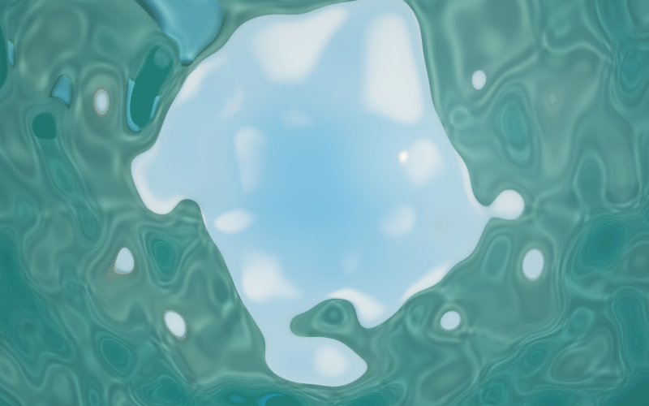

# Demo 07 · 潜入水下

系列方案见 [WATER_DEMOS.md](WATER_DEMOS.md)，岸线场景来自 [Demo 06](demo_06.md)。



## 启动与展示

```bash
cd /Users/john/git/CGPlayGround/Taichi
uv sync --locked
uv run python water/demo_07.py
# 观察沙床焦散
uv run python water/demo_07.py --preset bed
# 展示完整的 Snell 天空窗口
uv run python water/demo_07.py --preset window
# 导出截图
uv run python water/demo_07.py --headless --preset bed --output output/dive_bed.png
# 较快的预览配置
uv run python water/demo_07.py --width 800 --height 500 --samples 1 --reflection-samples 1
```

默认 960 × 600、四个空间采样、日间光照，先模拟 20 秒，让涌浪传播到岸边。
`--sea calm/surf/storm` 分别使用轻浪、碎浪和风暴；`--wave-amplitude` 与
`--wave-period` 可单独调节。日落的太阳较低，水下光照与焦散会减弱。

首次启动需要编译水上、水下及水线过渡路径，窗口在准备完成后打开，终端
显示准备进度。完整路径的冷编译可能需要数分钟，本轮 800 × 500 四采样实测首次准备约 305 秒、缓存后约 10 秒；缓存位于 `water/.taichi-cache/`。
切换视角不会再首次触发整条介质渲染路径的编译。

## 控制

| 操作 | 功能 |
|---|---|
| 左键拖动 / 右键拖动 | 旋转 / 沿地面平移 |
| W、S 或上下方向键 | 拉近 / 拉远 |
| 1 / 2 / 3 | 水上全景 / 低角度 / 俯视 |
| 4 | 水下礁石与波动水面内侧倒影 |
| 5 | 宽视野仰视完整 Snell 窗 |
| 6 | 近距离观察沙纹、石块、焦散与遮挡 |
| 空格 / N | 暂停继续 / 暂停时前进一步 |
| A / H | 自动环绕 / 显隐面板 |
| 点击水面 | 注入局部扰动 |
| P / R / Esc | 保存截图 / 重置 / 退出 |

相机可在整个海域平移；各预设拥有独立视野角。镜头始终与沙床保持至少
0.3 m 间距，自动环绕也会检查床面。水线附近采用有限镜头口径的画面过渡，
穿越时可同时看到水上与水下，避免整帧突然换色。

面板里的 `Fine waves` 控制随机方向短波，`Caustics` 控制床面聚光，
`Sun shafts` 控制沿视线积分的体积散射。三者可以独立归零比较效果。
`Water roughness` 影响水面内侧反射方向；四采样模式可分摊四个 GGX 反射
方向，单空间采样仍仅追踪一个反射方向。`Foam amount` 也影响水面内侧。

## 光学与计算

- **出水求交：** 对三次插值波面缓存局部坡度上界，沿网格边界推进并细化
  根。支持低仰角、水平以及遇到倾斜波面的下行光线；只在湿润区域接受交点。
  漏掉海床的水下射线返回深水散射，不再错误地采样天空。
- **反射与透射：** Snell 定律使用折射率 1.333，临界角约 48.6°。精确的
  非偏振 Fresnel 随角度连续变化；临界角以内也同时混合反射与透射。全反射
  与普通反射共享完整表面着色，包含礁石、沙床、阴影和材质细节。
- **水体颜色：** Beer–Lambert 衰减分别作用于红、绿、蓝，并使用完整的
  水中路径长度。入水阳光也受有色吸收；太阳阴影沿折射后的水中方向和
  空气中的方向检查，泡沫不再使地形失去太阳遮挡。
- **焦散：** 512 × 512 局部光图覆盖 64 m，中心位于 x = −22 m；每格
  0.125 m。阳光经长波与随机短波法线折射，真实求交沙床，再双线性沉积、
  加权滤波。域外返回中性照度 1，避免光图边界把海床染黑。
- **体积光：** 四分之一宽高的缓冲区，每条相机射线分层采样八次；累积
  入射阳光、视线路径衰减、Henyey–Greenstein 相函数和场景遮挡。按深度
  加权上采样，避免把床面两侧的光柱直接混在一起。
- **场景细节：** 新增三块水下圆角石作为前景与光线遮挡物，沙床加入有
  像素足迹过滤的细纹，保留岸线和水上背景。

追踪与着色分开，着色内核只保留一套完整的表面着色调用。相机射线从视图
参数重建，法线采用八面体编码，基础色采用 RGB8；每个空间采样的交点
记录由 13 个四字节分量组成。单采样离线渲染按需分配，交互模式保留四
采样容量，以便面板切换。

## 验证与边界

```bash
uv run python -m unittest water.tests.test_demo_07 -v
```

回归覆盖 Snell 关系与临界角、精确反射率、低仰角出水与倾斜波面、完整
水路径衰减、入射光有色吸收、焦散沉积与域外值、地形阴影、相机平移及
床面间距、编码误差、内存容量、暂停确定性、六个视角、两个效果滑杆，以及
窗口打开前的准备顺序。

这是单次散射与有限次数界面反射的实时近似。短波改变光学法线，未提升
浅水方程的空间分辨率；焦散光图不计算多次散射。体积光只积分前 40 m，
主体水色仍使用完整距离。水线过渡使用约 5 cm 的虚拟镜头口径，并非精确
的水下摄影镜头模型。高粗糙度反射采用有限样本，仍可能存在噪点。

本轮在 Metal 后端完成水下、天空窗口、沙床三种截图与五个水线位置检查，
原生窗口成功显示并自动退出。800 × 500 四采样床面视角的编译后三帧
测试约 99 ms/帧（短测结果，不代表所有视角）；降低空间采样和分辨率
可提高交互速度。
