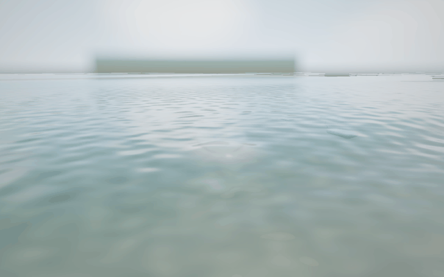

# Demo 08 · 击水与喷溅

系列方案见 [WATER_DEMOS.md](WATER_DEMOS.md)，岸线与水下渲染来自 [Demo 07](demo_07.md)。



[静态预览](preview_splash.png)

## 启动与展示

```bash
cd /Users/john/git/CGPlayGround/Taichi
uv sync --locked
uv run python water/demo_08.py
# 俯视观察完整水冠和回落波纹
uv run python water/demo_08.py --preset top
# 快速预览
uv run python water/demo_08.py --width 800 --height 500 --samples 1 --reflection-samples 1
# 四采样截图
uv run python water/demo_08.py --headless --output output/splash.png
```

默认日间光照、960 × 600、四个空间采样。先按固定子步预热整个场景20秒，
然后进入一次击水的展开阶段，使首次打开窗口即可看到核心效果。后续落石
围绕 x=−22、z=0 的展示区循环。全景、俯视和击水近景都围绕这个区域。
默认入射长波幅度0.18 m，海面粗糙度适当提高、短波适度减弱，让水花更清楚。
海床沙纹的颜色对比和法线扰动降至 Demo 07 的12%，避免透射后的
平行暗纹盖过水面波纹与水花。
`--sea calm/surf/storm` 仍可切换海况，`--wave-amplitude` 与 `--wave-period`
可单独设置。

首次启动需要编译水上、水下、拾取与透明合成内核，可能需要数分钟。
窗口在准备完成后打开，编译缓存位于 `water/.taichi-cache/`。

## 控制

| 操作 | 功能 |
|---|---|
| 左键拖动 / 右键拖动 | 旋转 / 沿地面平移 |
| W、S 或上下方向键 | 拉近 / 拉远 |
| 1 / 2 / 3 | 击水区域全景 / 岸线低角度 / 击水区域俯视 |
| 4 / 5 / 6 / 7 | 水下礁石 / Snell 窗 / 海床 / 击水近景 |
| 空格 / N | 暂停继续 / 暂停时推进一个模拟子步 |
| A / H | 自动环绕 / 显隐面板 |
| 点击湿润水面 | 触发喷溅，拾取实际波面并检查前方实体遮挡 |
| P / R / Esc | 保存截图 / 重置 / 退出 |

`Drop a stone now` 让下一块石头立即进入落石周期。`Spray brightness`
调节水冠与粒子的合成覆盖，归零可以在相同模拟状态下对照；`Splash foam`
调节冲击和回落泡沫，`Spray trails` 调节粗滴的短拖尾。光照、曝光、海况、
时间速度和介质渲染控制沿用前面的 demo。

## 升级后的计算与渲染

- **一致的时间步：** 每个1/30秒子步按顺序更新海面、水滴、回落反馈与
  落石。批量追帧等价于逐步推进，避免所有粒子读取同一最终时刻的波面。
  石块入水后保留短暂的阻力下沉过程，再移出演示场景。
- **正确发射与回落：** 先施加冲击、重建波面，再按每个粒子的局部水面
  加5.5cm间距发射。记录粒子距波面的距离，用穿面事件定位回落点，反馈
  强度随水滴尺寸的立方及实际入水速度变化。寿命覆盖完整飞行时间，避免
  大部分粒子在回落前提前消失。
- **水冠与分层喷溅：** 粒子池2048槽；每次冲击包含可调数量的粗滴、细雾
  和中心喷柱粒子，外加384个连续重叠的表面点组成参数化水冠。水冠扩张、
  升起、出现带细泡沫的不规则冠齿并淡出，弹道水滴继续飞行和回落。
- **零净体积扰动：** 击水与回落使用内外高斯配平的高度脉冲，按当前湿润
  网格的离散权重归一化，避免事件持续制造或抽走水体。它是波纹事件近似，
  不代表完整的粒子质量和流体动量守恒。泡沫先原子累积到独立缓冲，再
  统一限制范围，避免多个水滴同时落下时丢失反馈。
- **HDR透明合成：** 粒子纵轴与主相机一致，按相机深度计算足迹；近景
  足迹支持更大的覆盖范围。微球法线、Fresnel边缘、环境色、太阳高光和
  局部背景偏移提供水滴材质。颜色与覆盖权重分别累积，在线性HDR中
  合成，再走共享Bloom和色调映射；不把亮背景提前裁到1。
- **实体与介质分开：** 仅活动粒子参与路径准备。沙床、礁石、栈桥与落石
  使用场景求交遮挡，水面作为透明界面。跨介质投影以平面Snell解为起点，
  在插值重建的波面上迭代最小光学路径；未收敛路径被拒绝，水中路径用于
  有色衰减。水下粗滴拖尾关闭，避免直线拖尾与折射投影错位。
- **共享渲染流程：** Demo 07 提供后处理前的透明效果扩展入口；Demo 08
  复用它，不再复制整套水上、水下和水线过渡路径。

## 回归与边界

本轮已通过25项CPU回归检查，并用Metal实际验证水冠从展开到回落、
俯视、水下及Snell窗视角；原生窗口连续显示三帧，Demo 07启动检查通过。
最终水冠密度与材质调整后的7项相关复查也全部通过。800 × 500、四采样的三帧
窗口检查平均约267 ms/帧（含模拟、UI及同步），仍需按机器性能降低
分辨率或采样；首次冷编译明显慢于缓存启动。

```bash
uv run python -m unittest water.tests.test_demo_08 -v
```

检查覆盖发射间距与首步存活、真实回落比例、投影对齐、HDR高光、
透明水体与Snell方向、泡沫并行累积、速度对反馈的影响、事件体积配平、
水下拾取不接受镜头后方交点、水冠阶段、展示区域覆盖及批量子步一致性。
渲染检查在同一模拟状态下比较粒子覆盖开关，避免海面变化干扰结论。

水冠由参数化表面点构成，水滴和细雾使用屏幕空间近似，尚不是连续三维
流体表面。折射只求单次界面透射路径，未加入水滴的多次界面反射、
微波法线折射和多解选择；剧烈波况下部分路径可能被拒绝。透明覆盖是
加权近似，层间先后顺序和屏幕外背景折射不精确。浮点原子累积可能有
微小舍入差异，固定种子和子步保持模拟与视觉结果可复现。
